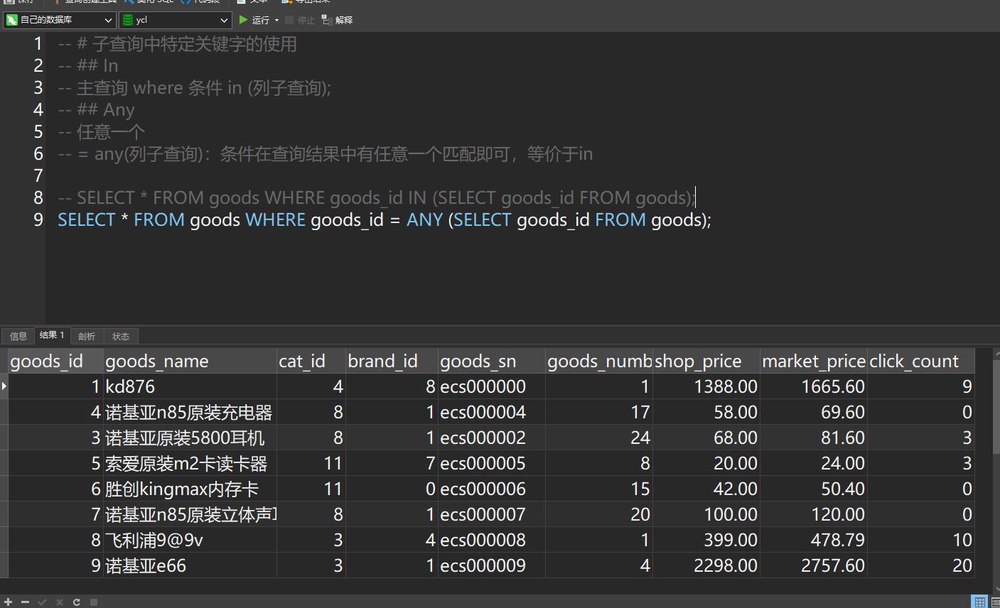

# 子查询

## 什么是子查询

###   子查询概念

子查询：sub query

 

子查询是一种常用计算机语言SELECT-SQL语言中嵌套查询下层的程序模块。当一个查询是另一个查询的条件时，称之为子查询。

 

子查询：指在一条select语句中，嵌入了另外一条select语句，那么被嵌入的select语句称之为子查询语句。

 

###   主查询概念

主查询：主要的查询对象，第一条select语句，确定的用户所有获取的数据目标（数据源），以及要具体得到的字段信息。

###   子查询和主查询的关系

1、 子查询是嵌入到主查询中的；

2、 子查询的辅助主查询的：要么作为条件，要么作为数据源

3、 子查询其实可以独立存在：是一条完整的select语句

## 子查询分类

### 按功能分

标量子查询：子查询返回的结果是一个数据（一行一列）

  列子查询：返回的结果是一列（一列多行）

  行子查询：返回的结果是一行（一行多列）

  表子查询：返回的结果是多行多列（多行多列）

  Exists子查询：返回的结果1或者0（类似布尔操作）

 

### 按位置分

​     Where子查询：子查询出现的位置在where条件中

​     From子查询：子查询出现的位置在from数据源中（做数据源）


# 创建练习表

建表

```sql
create table goods (
  goods_id mediumint(8) unsigned primary key auto_increment,
  goods_name varchar(120) not null default '',
  cat_id smallint(5) unsigned not null default '0',
  brand_id smallint(5) unsigned not null default '0',
  goods_sn char(15) not null default '',
  goods_number smallint(5) unsigned not null default '0',
  shop_price decimal(10,2) unsigned not null default '0.00',
  market_price decimal(10,2) unsigned not null default '0.00',
  click_count int(10) unsigned not null default '0'
) engine=myisam default charset=utf8
```

插入数据

```sql
insert into `goods` values (1,'kd876',4,8,'ecs000000',1,1388.00,1665.60,9),
(4,'诺基亚n85原装充电器',8,1,'ecs000004',17,58.00,69.60,0),
(3,'诺基亚原装5800耳机',8,1,'ecs000002',24,68.00,81.60,3),
(5,'索爱原装m2卡读卡器',11,7,'ecs000005',8,20.00,24.00,3),
(6,'胜创kingmax内存卡',11,0,'ecs000006',15,42.00,50.40,0),
(7,'诺基亚n85原装立体声耳机hs-82',8,1,'ecs000007',20,100.00,120.00,0),
(8,'飞利浦9@9v',3,4,'ecs000008',1,399.00,478.79,10),
(9,'诺基亚e66',3,1,'ecs000009',4,2298.00,2757.60,20),
(10,'索爱c702c',3,7,'ecs000010',7,1328.00,1593.60,11),
(11,'索爱c702c',3,7,'ecs000011',1,1300.00,0.00,0),
(12,'摩托罗拉a810',3,2,'ecs000012',8,983.00,1179.60,13),
(13,'诺基亚5320 xpressmusic',3,1,'ecs000013',8,1311.00,1573.20,13),
(14,'诺基亚5800xm',4,1,'ecs000014',1,2625.00,3150.00,6),
(15,'摩托罗拉a810',3,2,'ecs000015',3,788.00,945.60,8),
(16,'恒基伟业g101',2,11,'ecs000016',0,823.33,988.00,3),
(17,'夏新n7',3,5,'ecs000017',1,2300.00,2760.00,2),
(18,'夏新t5',4,5,'ecs000018',1,2878.00,3453.60,0),
(19,'三星sgh-f258',3,6,'ecs000019',12,858.00,1029.60,7),
(20,'三星bc01',3,6,'ecs000020',12,280.00,336.00,14),
(21,'金立 a30',3,10,'ecs000021',40,2000.00,2400.00,4),
(22,'多普达touch hd',3,3,'ecs000022',1,5999.00,7198.80,16),
(23,'诺基亚n96',5,1,'ecs000023',8,3700.00,4440.00,17),
(24,'p806',3,9,'ecs000024',100,2000.00,2400.00,35),
(25,'小灵通/固话50元充值卡',13,0,'ecs000025',2,48.00,57.59,0),
(26,'小灵通/固话20元充值卡',13,0,'ecs000026',2,19.00,22.80,0),
(27,'联通100元充值卡',15,0,'ecs000027',2,95.00,100.00,0),
(28,'联通50元充值卡',15,0,'ecs000028',0,45.00,50.00,0),
(29,'移动100元充值卡',14,0,'ecs000029',0,90.00,0.00,0),
(30,'移动20元充值卡',14,0,'ecs000030',9,18.00,21.00,1),
(31,'摩托罗拉e8 ',3,2,'ecs000031',1,1337.00,1604.39,5),
(32,'诺基亚n85',3,1,'ecs000032',4,3010.00,3612.00,9);
```


# 标量子查询

## 概念

标量子查询：子查询得到结果是一个数据（一行一列）

## 语法

基本语法：select * from 数据源 where 条件判断 =/<> (select 字段名 from 数据源 where 条件判断); //子查询得到的结果只有一个值

 

 

# 列子查询

## 概念

列子查询：子查询得到的结果是一列数据（一列多行）

## 语法

基本语法：

主查询 where 条件 in (列子查询);


# 行子查询

## 概念

行子查询：子查询返回的结果是一行多列

## 行元素

行元素：字段元素是指一个字段对应的值，行元素对应的就是多个字段：多个字段合起来作为一个元素参与运算，把这种情况称之为行元素。

## 语法

基本语法：

主查询 where 条件[（构造一个行元素）] = (行子查询);


 

## 总结

已经学过三个子查询：常见的三个子查询

标量子查询、列子查询和行子查询：都属于where子查询

# 表子查询

## 概念

表子查询：子查询返回的结果是多行多列，表子查询与行子查询非常相似，只是行子查询需要产生行元素，而表子查询没有。

 

行子查询是用于where条件判断：where子查询

表子查询是用于from数据源：from子查询

## 语法

基本语法：

 

Select 字段表 from (表子查询) as 别名 [where] [group by] [having] [order by] [limit];


# Exists子查询

## 概念

Exists子查询：查询返回的结果只有0或者1，1代表成立，0代表不成立

## 语法

基本语法：where exists(查询语句); //exists就是根据查询得到的结果进行判断：如果结果存在，那么返回1，否则返回0

 

Where 1：永远为真


 

# 子查询中特定关键字的使用

## In

主查询 where 条件 in (列子查询);

## Any

任意一个

= any(列子查询)：条件在查询结果中有任意一个匹配即可，等价于in




<>any(列子查询)：条件在查询结果中不等于任意一个

(images/clip_image014.jpg)

 

1 =any(1,2,3) ===== true

1 <>any(1,2,3) ===== true

 

## Some

与any完全一样：在国外，some与any的正面含义一致，但是否定就大不相同：not any与not some

 

开发者为了让对应的使用者不要在语法上纠结：重新设计了some

## All

= all(列子查询)：等于里面所有

<>all(列子查询)：不等于其中所有


 

All数据展示


 

 

如果对应的匹配字段有NULL，那么不参与匹配


# 外键

## 外键概念

如果公共关键字在一个关系中是主关键字，那么这个公共关键字被称为另一个关系的外键。由此可见，外键表示了两个关系之间的相关联系。以另一个关系的外键作主关键字的表被称为主表，具有此外键的表被称为主表的从表。外键又称作外关键字。

 

外键：foreign key

一张表（A）中有一个字段，保存的值指向另外一张表（B）的主键

B：主表

A：从表

 

## 外键的操作

###   增加外键

Mysql中提供了两种方式增加外键

1、 方案1：在创建表的时候增加外键（类似主键）

基本语法：在字段之后增加一条语句

[constraint `外键名`] foreign key(外键字段) references 主表(主键);


 

MUL：多索引，外键本身是一个索引，外键要求外键字段本身也是一种普通索引


2、 方案2：在创建表后增加外键

Alter table 从表 add [constraint `外键名`] foreign key(外键字段) references 主表(主键);


 

外键名字可以指定


 

### 修改&删除外键

外键不允许修改，只能先删除后增加

基本语法：alter table 从表 drop foreign key 外键名字;


 

外键不能删除产生的普通索引，只会删除外键自己


 

如果想删除对应的索引：alter table 表名 drop index 索引名字;

###   外键基本要求

1、 外键字段需要保证与关联的主表的主键字段类型完全一致；

2、 基本属性也要相同

3、 如果是在表后增加外键，对数据还有一定的要求（从表数据与主表的关联关系）

4、 外键只能使用innodb存储引擎：myisam不支持

## 外键约束

外键约束：通过建立外键关系之后，对主表和从表都会有一定的数据约束效率。

###   约束的基本概念

1、 当一个外键产生时：外键所在的表（从表）会受制于主表数据的存在从而导致数据不能进行某些不符合规范的操作（不能插入主表不存在的数据）；


2、 如果一张表被其他表外键引入，那么该表的数据操作就不能随意：必须保证从表数据的有效性（不能随便删除一个被从表引入的记录）


###   外键约束的概念

 

可以在创建外键的时候，对外键约束进行选择性的操作。

 

基本语法： add foreign key(外键字段) references 主表(主键) on 约束模式;

 

约束模式有三种：

1、 district：严格模式，默认的，不允许操作

2、 cascade：级联模式，一起操作，主表变化，从表数据跟着变化

3、 set null：置空模式，主表变化（删除），从表对应记录设置为空：前提是从表中对应的外键字段允许为空

 

外键约束主要约束的对象是主表操作：从表就是不能插入主表不存在的数据

 

通常在进行约束时候的时候，需要指定操作：update和delete

常用的约束模式： on update cascade, on delete set null，更新级联，删除置空


 

 

更新模式


 

删除模式


 

### 约束作用

保证数据的完整性：主表与从表的数据要一致

 

正是因为外键有非常强大的数据约束作用，而且可能导致数据在后台变化的不可控。导致程序在进行设计开发逻辑的时候，没有办法去很好的把握数据（业务），所以外键比较少使用。

 

 